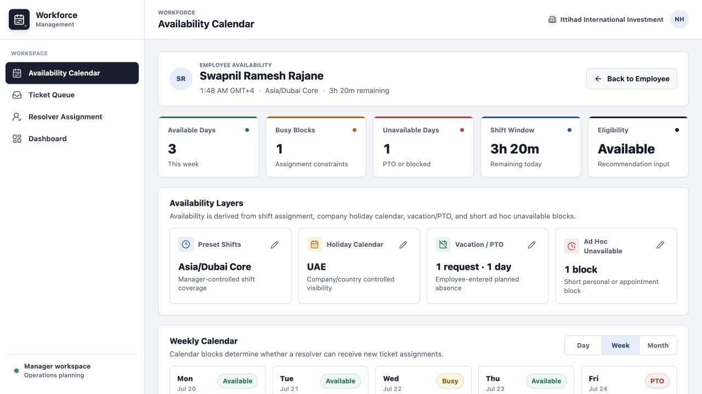
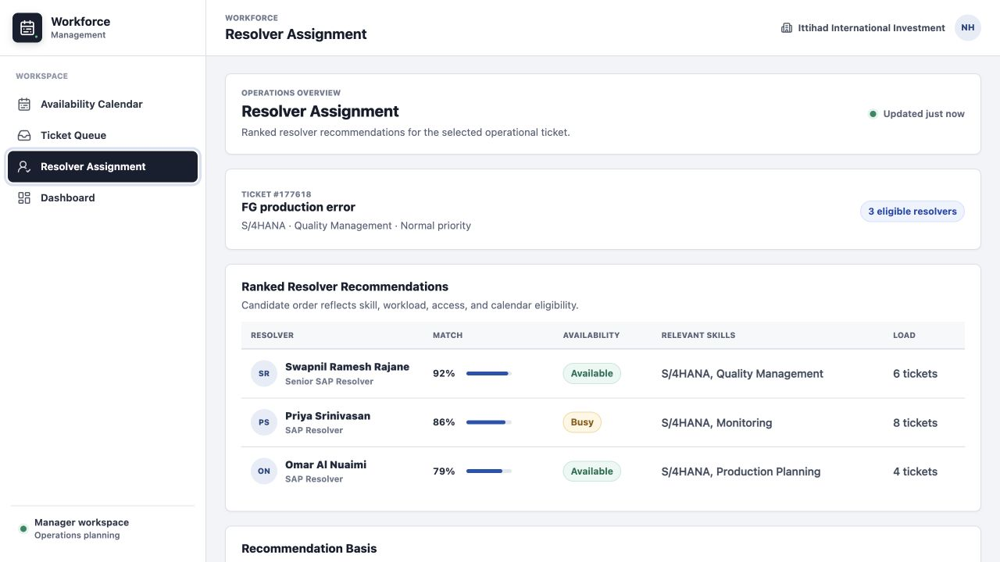
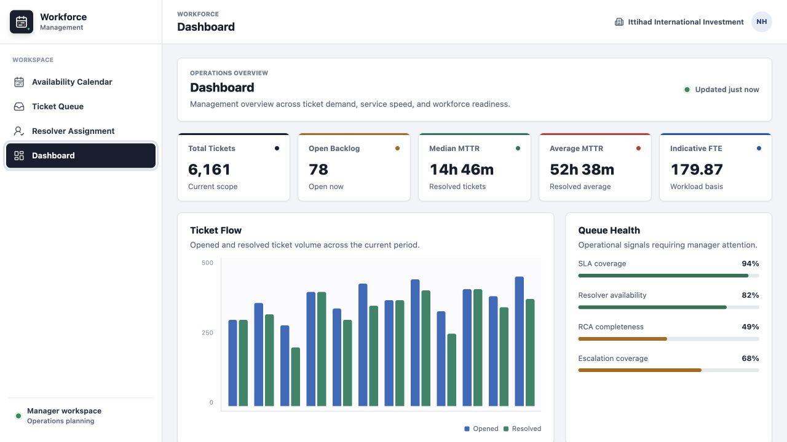

<div align="center">

# Workforce Management Reimagined

An intuitive workforce operations prototype for managing availability, ticket demand, and resolver assignments.

[View Live Demo](https://workforce-management-reimagined.vercel.app)

</div>

## Overview

This project grew out of my experience working with enterprise workforce software. It explores a more intuitive and accessible workflow that helps users quickly enter, review, and manage workforce data while giving managers clearer context for staffing and assignment decisions.

The primary experience is a fully editable employee availability calendar supported by ticket queue, resolver assignment, and operational dashboard views. The prototype is built with React and a small Vercel serverless API. Calendar changes are preserved in the browser, while the API provides the initial workforce model and validates submitted availability data.

## Product Walkthrough

### 1. Manage Employee Availability

The employee workspace brings weekly capacity, shift coverage, holidays, PTO, and short unavailable periods into one view. Managers can edit each availability layer, change a daily status, and add calendar events without leaving the employee context.



### 2. Compare Resolver Recommendations

The resolver assignment view compares eligible employees using skill match, current workload, queue access, and calendar availability. Managers can understand why a resolver is recommended before making an assignment decision.



### 3. Monitor Workforce Operations

The management dashboard summarizes ticket demand, service performance, staffing requirements, and queue health so operational risks are visible at a glance.



## Core Experience

- Edit employee availability in day, week, and month views
- Apply one or multiple preset shifts and refine coverage times
- Review company holiday calendars in a yearly preview
- Create, revisit, and update vacation or PTO requests
- Add short ad hoc unavailable blocks with exact start and end times
- Create meetings, check-ins, training, and ticket-review events
- Change resolver status directly from daily, weekly, or monthly views
- Review ticket queues, ranked resolver recommendations, and workforce metrics

## Technology

| Area | Implementation |
| --- | --- |
| Frontend | React 18 and Vite 6 |
| Styling | Responsive CSS design system |
| Icons | Focused Lucide icon set |
| API | Vercel serverless function |
| Demo persistence | Browser local storage |
| Hosting | Vercel |

## Project Structure

```text
api/
  availability.js       Availability model and API validation
docs/screenshots/       Product screenshots used in this README
src/
  icons.jsx             Focused interface icon set
  main.jsx              Application views and workflows
  styles.css            Responsive product design system
```

## Run Locally

```bash
npm install
npm run dev
```

Open the local URL shown by Vite.

## Production Build

```bash
npm run build
npm run preview
```

## API Contract

`GET /api/availability` returns the demonstration employee profile, availability layers, calendar entries, rules, and exceptions.

`POST /api/availability` validates the submitted profile and returns the accepted data with a save timestamp. The portfolio demo keeps edits in browser local storage rather than a production database.

## Deployment

The repository is configured for Vercel. Connect the GitHub repository to a Vercel project and use the included Vite build settings; pushes to the production branch will deploy automatically.
